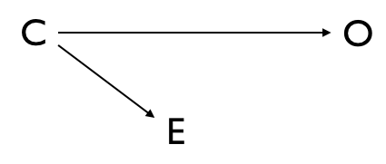
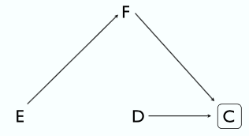
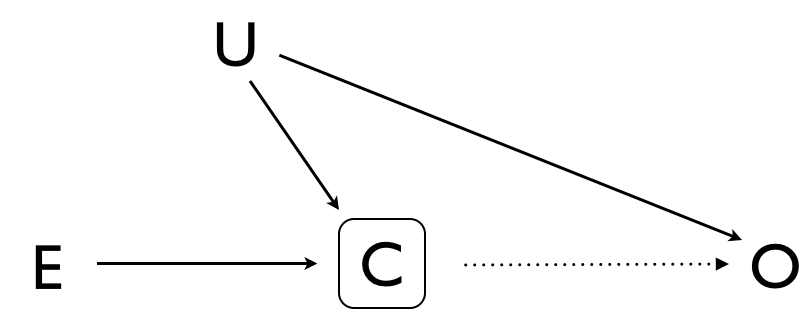

```{r setup, include = FALSE}
knitr::opts_chunk$set(cache = TRUE, error = TRUE, fig.width = 4, fig.asp = 1)
library(tidyverse)
library(broom)
theme_set(theme_classic() +
          theme(axis.line.x = element_line(color = 'black'),
                axis.line.y = element_line(color = 'black')))
```


Linear Regression
=================
Recommended reading: Regression Modeling Strategies: With Applications to Linear Models, Logistic and Ordinal Regression, and Survival Analysis (Springer Series in Statistics) 2nd ed. 2015 Edition by Frank Harrell


Why use Linear Models?
----------------------

- Hypothesis Testing: Building a model to test if an exposure is statistically associated with an outcome. This can extend to multiple hypotheses, but care must be taken with interpretation of the significance measures.

- Estimation: Building a model to estimate the effect of an exposure on an outcome.

- Prediction: Building a model using training data to predict a future outcome.


Planning
--------

If you fail to plan, you should plan to fail.

Convenience samples are often what we are left with when we fail to properly plan a study. Also, scientists are always learning and are often tempted to introduce new hypotheses into a study after the data has been collected. This isn't neccessarily a bad thing, but it can lead to problems in the analysis. Exercise caution. The resulting analyses are often plagued by difficulties including:

[//]: # \textcolor{red}{Comment on secondary studies}

- The sample size is too small to answer the questions the study leaders(s) would like to ask -- i.e. they are unable to test the hypotheses set forth at the beginning of the study with any reasonable level of statistical power. This often arises out of a lack of focus, or a desire to test every possible hypothesis we can think of.

- When collaborators are brought into the study, it is often discovered that important exposures have not been collected (sometimes the most important exposures are missing or are hopelessly biased).

- The study subjects making up the sample suffer from a lack of definition, they don't represent the population we planned to study (e.g. because the primary outcome has been biased or because our sample doesn't include enough variation from the population under study). Poor representation of the population we would like to study is often a function of poor selection of study sites from which to collect the data.

- Many / important variables have large amounts of missing data.

- Missing data in the sample are not missing at random.

- Many / important variables are poorly defined, leading to heterogeneity in what is actually gathered at different study sites.

[//]: # \textcolor{red}{Information Bias}

- A lack of a data validation plan can lead to varying quality of data collection at different sites. This can result in some sites presenting with an excess of issues described above.


### Bias: The difference between an estimator's expected value and it's true value is non-zero. Alternately, bias can be thought of as resulting in a systemic difference between a statistic and the true population parameter.

- Confounding: 1) Confounding occurs when there exists a back-door pathway between the exposure and the outcome. 2) Confounding occurs when the frequency of disease in the ovserved comparison (unexposed) population is different from the frequency of disease in the exposed population, had they been unexposed.
    - Confounding variables must cause disease
    - Confounding variables must be associated with the exposure (e.g. correlated)
    - Condounding variables may not be directly affected by the exposure
    
{width=50%}

- Misclassification / Information Bias: Misclassification or information bias occurs when the disease status influences how the exposure is measured. Examples include:
    - Recall bias
    - Interviewer bias
    - Data collection bias
    
- Selection Bias: Selection bias occurs when the measure of association in the study sample is different than in the source population. This can occur when selection for inclusion into the study is influenced by an exposure and by a cause of the outcome (in cohort studies) or by the outcome itself (in case/control studies). In the graphical representation shown below, the exposure, E, causes a factor, F, which causes selection, C. Disease, D, also is a basis for selection. An example of this is when exposure causes hospitalization.

{width=50%}

- Collider-Stratification Bias: This occurs when conditioning on a collider variable, C, opens a back-door pathway through some unmeasured factor(s), U, inducing a false association between and effect, E, and the outcome, O. There may or may not be a causitive relationship between C and O. For an example of this where the effect of a mothers smoking is paradoxically associated with a protective effect on infant mortality, see [https://www.ncbi.nlm.nih.gov/pmc/articles/PMC2743120/pdf/nihms-135847.pdf](https://www.ncbi.nlm.nih.gov/pmc/articles/PMC2743120/pdf/nihms-135847.pdf).

{width=50%}

[//]: # 

In general, there are a number of predictor variables that we should always consider at potential confounders. The predictors on Harrell's list will rarely all be needed for any one study, but he provides a good list to consider:
- age
- sex
- acute clinical stability
- principal diagnosis
- severity of principal diagnosis
- extent and severity of comorbidities
- physical functional status
- psychological, cognitive and psychosocial functioning
- cultural, ethnic and socioeconomic attributes and behaviors
- health status and quality of life
- patient attitudes and preferences for outcomes

#### Group Activity
Building our own epidemiological model: Breast Cancer - predict the number of lymphnodes testing positive for cancer during primary tumor removal.

[//]: # (\textcolor{red}{Variables included in the GBSG set: nodes $\sim$ age, menopause status, tumor size, cancer stage, measures of progesterone and estrogen receptors, given tamoxifen (and survival to relapse).})

Notation and Formulation
------------------------

```{r import of German Breast Cancer Dataset}
# Read in German Breast Cancer dataset
# url('http://biostat.mc.vanderbilt.edu/wiki/pub/Main/DataSets/gbsg.sav') %>%
#   load()
load('gbsg.sav') # in case the above doesn't work?

# some decidedly odd formatting here
str(gbsg)

# Convert funky formatting of data.frame to a tibble
gbsg <- as_data_frame(gbsg) %>%
  mutate(id = as.integer(id),
         age = as.integer(age),
         meno = as.character(meno),
         size = as.integer(size),
         grade = as.integer(grade),
         nodes = as.integer(nodes),
         enodes = as.double(enodes),
         pgr = as.integer(pgr),
         er = as.integer(er),
         hormon = as.character(hormon),
         d = as.integer(d),
         t = as.double(t))
```

```{r first model, include = FALSE}
gbsg.lm <- lm(nodes ~ age + size*grade + meno + pgr + er + hormon, data = gbsg) %>%
  tidy()
```

Interpretation of Model Parameters
----------------------------------

### Continuous
Continuous predictors describe the slope of the regression line.

$$\mbox{E}(nodes_i) = \beta_0 + \beta_1 * size_i$$

```{r continuous predictor}
lm(nodes ~ size, data = gbsg) %>%
  tidy()

ggplot(gbsg) +
  geom_smooth(aes(size, nodes), method = 'lm')
```

### Categorical
Categorical predictors modify only the intercept of the regression line. In this example, the expected value of the response variable, $nodes$, is $\beta_0$ for menopausal women and $\beta_0 + \beta_1$ for pre-menopausal women. Thus, $\beta_2$ is the *difference* in $nodes$ between menopausal and pre-menopausal women.

$$\mbox{E}(nodes_i) = \beta_0 + \beta_2 * meno_i$$

```{r smiple categorical}
lm(nodes ~ meno, data = gbsg) %>%
  tidy()
```

In the case of a multiple linear regression, the slopes of the regression lines are identical for each group.

$$\mbox{E}(nodes_i) = \beta_0 + \beta_1 * size_i + \beta_2 * meno_i$$

```{r categorical multi LM}
lm(nodes ~ size + meno, data = gbsg) %>%
  tidy()
```

### Interactions
Including an interaction term between $size$ and $meno$ tells the model to allow the slopes of the regression lines to differ for the two different $meno$ groups. In this model, the *difference* in slope for the two menopause groups is $\beta_3$.

$$\mbox{E}(nodes_i) = \beta_0 + \beta_1 * size_i + \beta_2 * meno_i + \beta_3 * (size_i * meno_i)$$

```{r categorical predictor with interaction}
lm(nodes ~ size * meno, data = gbsg) %>%
  tidy()

ggplot(gbsg, aes(size, nodes, group = meno)) +
  geom_smooth(method = 'lm')
```

## Homework

- Write a methods section describing the gbsg data set and the analysis we performed in class. Include enough information that the reader would be able to know what samples to collect and how to analyze them to reconstruct/replicate your results. **Limit: 400 words**.

- Write a results section with table(s) and figure(s) describing the results of the analysis.
