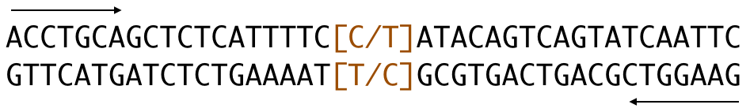

```{r setup, include=FALSE}
knitr::opts_chunk$set(echo = FALSE)
library(tidyverse)
library(cowplot)
library(hwde)
library(ggplot2)

theme_update(text = element_text(size = 20))

# colorbline palette
cbbPalette <- c("#000000", "#E69F00", "#56B4E9", "#009E73", 
                "#F0E442", "#0072B2", "#D55E00", "#CC79A7")
```

## Setup

\small
```{r setup slide, eval = FALSE, echo = TRUE}
knitr::opts_chunk$set(echo = FALSE)
library(tidyverse)
library(cowplot)
library(hwde)
library(ggplot2)

# colorbline palette
cbbPalette <- c("#000000", "#E69F00", "#56B4E9", "#009E73", 
                "#F0E442", "#0072B2", "#D55E00", "#CC79A7")
```

## Quality Control

- Aim of quality control: reduce bias in our statistics.
- Many of the methods discussed today apply to other types of analysis.

## Microarray vs NGS Technologies

)](../Images/13_Microarray_NGS.png)

## Summary of How Microarrays Work: Affymetrix

](../Images/13_AffyChipExplained_Nickerson.png)

## Summary of How Microarrays Work: Affymetrix

](../Images/13_AffyWorkflow_Nickerson.png)

## Summary of How Microarrays Work: Illumina

\begin{centering}
\begin{figure}
\includegraphics[height=2.5in]{../Images/13_Illumina1_Nickerson.png}
\caption{DNA fragments are captured on microbeads in Illumin platform (\href{http://egp.gs.washington.edu/workshop/download/Day2_1045am_Nickerson.pdf}{image courtesy of Nickerson})}
\end{figure}
\end{centering}

## Summary of How Microarrays Work: Illumina

](../Images/13_Illumina2_Nickerson.png)

## Summary of How Microarrays Work: Genotype Inferrence

\begin{centering}
\begin{figure}
\includegraphics[height=2.5in]{../Images/13_AllelicDiscrimination.png}
\caption{Intensities of A and B alleles are clustered to infer genoyptes.}
\end{figure}
\end{centering}

## Genome Wide Association Studies (GWAS)

](../Images/13_gwas_2013-12.pdf)

## Batch Effects: Problem

- Microarrays are tricky things
- Results can be slightly influenced (i.e. different) by processing date, lab tech, equipment used, $\ldots$
- Every effort should be made to follow your protocol as exactly as possible, but you are still going to end up with batch effects.


## Batch Effects: Solution

- Solution: Randomization breaks the link between disease and batch, which breaks the false association between SNP and disease.

- Alternate solution: Include batch number in your statistical model. Randomization is better, but sometimes we don't get a say in the matter.

$$
\begin{aligned}
disease =& \beta_0 + \beta_{b1} batch_1 + \beta_{b2} batch_2 + \cdots + \\
         & \beta_1 X_1 + \cdots + \beta_n X_n + \varepsilon
\end{aligned}
$$


## Batch Randomization

Lets say we have 1000 samples we need to split over 10 batches of 100 each.

\small
```{r batch randomization1, echo = TRUE, eval = FALSE}
set.seed(87346)
samples <- data_frame(
               id = 1:1000,
               disease = c(rep(TRUE, 500), rep(FALSE, 500)),
               ## other clinical observations,
               batch = sample(rep(1:10, each = 100), 1000))
```

## Batch Randomization

Again, our study will collect 1000 samples, which will need to be split into 10 batches of 100 each. This time, however, we expect the samples to be collected over a 5 year period, due to the low incidence of our disease. Also, we can't wait until the end of collection to run all the batches at once.

- Collect controls at the same time as the cases!!
- When you have collected 50 cases with their corresponding 50 controls, run a batch.
- If your technology has sub-batches (e.g. lanes) randomize the distribution of your cases and controls across those sub-batches as well.

## Genotyping Quality: Problem

- We assume that the technology is performing as it should.
- If it is performing as it should, we expect to get complete data (i.e. not very many missing values).
- If there are too many missing values, something is probably wrong with either the sample or the technology!
- Sources of "wrongness" include:
    - Poor DNA quality
    - Poor reagent quality
    - Contamination
    - Poor adherance to protocol

## Genotyping Quality: Solution

If there is a problem with your genotyping quality, you are really only left with two viable options:

- Redo the genotyping
- Remove the offending individuals/SNPs from the analysis

You can expect a small proportion of your SNPs to fail, and it is not uncommon to have a small proportion of your samples fail. The general rule of thumb is: there should be no more than 3-5% of your genotypes are missing for each individual, and no more than 3-5% of individuals have a missing genotype for each SNP.

- Too many missing genotypes for a SNP: Assay problem
- Too many missing genotypes for an individual: Sample problem

## Genotyping Quality: Non-Solution

- Fancy bioinformatics will not solve genotyping quality problems!

\vspace{12pt}
- If your DNA is of low quality, your data are of low quality.
- If your assay is of low quality (e.g. due to a bad lot of a reagent), your data are of low quality.

\vspace{12pt}
- If your data are of low quality, your statistics are suspect.

\vspace{12pt}
- If your statistics are suspect, your inferences/conclusions are also suspect (i.e. they are no good)!

## Genotyping Quality: Solution

- This will remove all SNPs with more than 5% of their genotypes missing (you may also want to remove any SNPs with a very low minor allele frequency using the `--maf` option):
```{r geno missing, echo=TRUE, eval=FALSE}
plink --bfile mydata --geno 0.05 --maf 0.01 --recode
```

- This will remove all individuals with more than 5% of their genotypes missing:
```{r indiv missing, echo=TRUE, eval=FALSE}
plink --bfile mydata --mind 0.05 --recode
```

- The `--recode` option will generate a new set of PLINK files. You can include more than one filtering command in a single call.

## Genotyping Quality: HWE

- Hardy-Weinberg Equilibrium (HWE) is another indicator of poor genotyping quality.

\begin{center}
\begin{tabular}{r|c|c}
  &    A     &    a     \\ \hline
A & $f_{AA}$ & $f_{aA}$ \\ \hline
a & $f_{Aa}$ & $f_{aa}$
\end{tabular}
\end{center}

$$ p = f_{AA} + \frac{f_{Aa} + f_{aA}}{2} $$
$$ q = f_{aa} + \frac{f_{Aa} + f_{aA}}{2} $$

## HWE: Assumption of Genetic Equilibrium

Under the assumption of genetic equilibrium in the population, 

$$
\begin{aligned}
         f_{AA} =& \mbox{P}(A \mbox{ from mom} \cap
                            A \mbox{ from dad}) \\
                =& p^2, \\
         f_{aa} =& \mbox{P}(a \mbox{ from mom} \cap
                            a \mbox{ from dad}) \\
                =& q^2, \\
         f_{Aa} =& f_{aA}, \\
f_{Aa} + f_{aA} =& \mbox{P}(A \mbox{ from mom} \cap
                            a \mbox{ from dad}) + \\
                 & \mbox{P}(a \mbox{ from mom} \cap
                            A \mbox{ from dad}) \\
                =& 2pq,\\
p^2 + 2pq + q^2 =& 1.
\end{aligned}
$$

## Genotyping Quality: Testing HWE Assumption

We can test this assumption using a Chi-squared test as follows:

- Calculate $p$ and $q$ (sample size is $n$).
- Define:
    - $O_{AA}=$ Observed number of individuals with $AA$ genotype,
    - $O_{Aa}=$ Observed number of individuals with $Aa$ genotype,
    - $O_{aa}=$ Observed number of individuals with $aa$ genotype.

$$ \frac{\left(O_{AA} - n*p^2\right)^2}{n*p^2} +
   \frac{\left(O_{Aa} - n*2pq\right)^2}{n*2pq} +
   \frac{\left(O_{aa} - n*q^2\right)^2}{n*q^2} \sim \chi^2_1 $$

\vspace{12pt}
- Some SNPs will not fall within HWE expectations simply as a natural result of frequency deviations
- Research indicates that most of these deviations are due to genotyping errors

## Genotyping Quality: HWE Assumption Example 1

\begin{multicols}{2}
$$
\begin{aligned}
O_{AA} &= 1469 \\
O_{Aa} &= 138  \\
O_{aa} &= 5 \\
     n &= 1469 + 138 + 5 \\
       &= 1612 \\
     p &= \frac{2*O_{AA} + O_{Aa}}{2n} \\
       &= \frac{2*1469 + 138}{2*1612} \\
       &= 0.954 \\
     q &= \frac{2*O_{aa} + O_{Aa}}{2n} \\
       &= \frac{2*5 + 138}{2*1612} \\
       &= 0.046
\end{aligned}
$$
\\ \columnbreak
$$
\begin{aligned}
    q  &= (1 - p) \\
E_{AA} &= n*p^2 \\
       &= 1612 * 0.954^2 \\
       &= 1467.4 \\
E_{Aa} &= n*2pq \\
       &= 1612 * (2*0.954*0.046) \\
       &= 141.2 \\
E_{aa} &= n*q^2 \\
       &= 1612 * 0.046^2 \\
       &= 3.4 \\
\chi^2_1 &= \sum \frac{\left(O - E\right)^2}{E}\\
~
\end{aligned}
$$
\end{multicols}

## Genotyping Quality: HWE Assumption Example 1

$$
\begin{aligned}
\chi^2_1 &= \frac{(1469 - 1467.4)^2}{1467.4} + 
            \frac{(138 - 141.2)^2}{141.2} +
            \frac{(5 - 3.4)^2}{3.4} \\
         &= 0.001 + 0.073 + 0.756 \\
         &= 0.83
\end{aligned}
$$

```{r hwe1, echo = TRUE}
pchisq(0.83, 1, lower.tail = FALSE)
hwexact(1469, 138, 5)
```

## Genotyping Quality: HWE Assumption Example 2

\begin{multicols}{2}
$$
\begin{aligned}
O_{AA} &= 1465 \\
O_{Aa} &= 138  \\
O_{aa} &= 9 \\
     n &= 1465 + 138 + 9 \\
       &= 1612 \\
     p &= \frac{2*O_{AA} + O_{Aa}}{2n} \\
       &= \textcolor{white}{\frac{2*1465 + 138}{2*1612}} \\
       &= \textcolor{white}{0.952} \\
     q &= \frac{2*O_{aa} + O_{Aa}}{2n} \\
       &= \textcolor{white}{\frac{2*9 + 138}{2*1612}} \\
       &= \textcolor{white}{0.048}
\end{aligned}
$$
\\ \columnbreak
$$
\begin{aligned}
    q  &= (1 - p) \\
E_{AA} &= n*p^2 \\
       &= \textcolor{white}{1612 * 0.958^2} \\
       &= \textcolor{white}{1479.4} \\
E_{Aa} &= n*2pq \\
       &= \textcolor{white}{1612 * (2*0.958*0.042)} \\
       &= \textcolor{white}{129.7} \\
E_{aa} &= n*q^2 \\
       &= \textcolor{white}{1612 * 0.042^2} \\
       &= \textcolor{white}{2.8} \\
\chi^2_1 &= \sum \frac{\left(O - E\right)^2}{E}\\
~
\end{aligned}
$$
\end{multicols}

## Genotyping Quality: HWE Assumption Example 2

$$
\begin{aligned}
\chi^2_1 &= \frac{\textcolor{white}{(1465 - 1479.4)^2}}{\textcolor{white}{1479.4}} + 
            \frac{\textcolor{white}{(138 - 129.7)^2}}{\textcolor{white}{129.7}} +
            \frac{\textcolor{white}{(9 - 2.8)^2}}{\textcolor{white}{2.8}} \\
         &= \textcolor{white}{0.140 + 0.531 + 13.729} \\
         &= \textcolor{white}{14.4}
\end{aligned}
$$

```{r hwe2, echo = TRUE, eval = FALSE}
pchisq(     , 1, lower.tail = FALSE)
hwexact(    ,     ,   )
```

$$ p_{\chi^2} = $$
$$ p_{exact} = $$

## Genotyping Quality: HWE Solution

Use the `--hwe` option in PLINK to filter on a specific threshold (0.001 is common),

```{r hwe, eval=FALSE, echo=TRUE}
plink --bfile mydata --hwe 0.001 --recode
```

or you can get a summary of the HWE test statistics using the `--hardy` option,

```{r hardy, eval=FALSE, echo=TRUE}
plink --bfile mydata --hardy
```

which creates a file called `plink.hwe` with the following columns of data:

\scriptsize
```{r hardy out, eval=FALSE, echo=TRUE}
## SNP             SNP identifier
## TEST            Code indicating sample
## A1              Minor allele code
## A2              Major allele code
## GENO            Genotype counts: 11/12/22 
## O(HET)          Observed heterozygosity
## E(HET)          Expected heterozygosity
## P               H-W p-value
```

## Asside on the $\chi^2$ Test (i.e. Pearson $\chi^2$ Test)

- This is used to test the frequency distribution of a sample is consistent with a theoretical distribution.

    - NULL under HWE: $E_{AA} = np^2$, $E_{AB} = 2npq$, and $E_{BB} = nq^2$.
    - NULL for 2 tosses of fair coin (n times): $E_{HH} = 0.25n$, $E_{HT} = 0.5n$, $E_{TT} = 0.25n$.
    - NULL for 1 toss of fiar die (n times): $E_1 = E_2 = \cdots = E_6 \approx 0.167n$.

- The test statistic takes the form:

$$ \chi^2_1 = \sum_j\frac{\left(O_j - E_j\right)^2}{E_j} $$

## Asside on the $\chi^2$ Test: Example

- Our test statistic for the number of coin tosses is:

$$ \chi^2_1 = \frac{\left(O_{HH} - 0.25n\right)^2}{0.25n} + 
              \frac{\left(O_{HT} - 0.5n\right)^2}{0.5n} + 
              \frac{\left(O_{TT} - 0.25n\right)^2}{0.25n} $$

## Asside on the $\chi^2$ Test: Example

\small
```{r chisq1, echo = TRUE}
set.seed(872364)
n <- 100
tosses <- sample(c('HH', 'HT', 'TT'), size = n, replace = TRUE,
                 prob = c(0.36, 0.48, 0.16)) # P(H) = 0.6
table(tosses)
sum((c(35, 46, 19) - n*c(0.25, 0.5, 0.25))^2 / 
        n*c(0.25, 0.5, 0.25))
pchisq(0.42, df = 1, lower.tail = FALSE)
```

## Asside on the $\chi^2$ Test: Example

\small
```{r chisq2, echo = TRUE}
set.seed(72364)
n <- 1000
tosses <- sample(c('HH', 'HT', 'TT'), size = n, replace = TRUE,
                 prob = c(0.36, 0.48, 0.16)) # P(H) = 0.6
table(tosses)
sum((c(384, 459, 157) - n*c(0.25, 0.5, 0.25))^2 / 
        n*c(0.25, 0.5, 0.25))
pchisq(7.492, df = 1, lower.tail = FALSE)
```

## Asside on the $\chi^2$ Test: Applications

- Potential uses:

    - Test HWE
    - Check HLA-A allele distribution in a sample, compared to known reference
    
- Not appropriate for:

    - Test mean blood pressure (not categorical)
    - Test HLA-A and HLA-B allele distributions (frequencies must add to 1; would need two separate tests).

## Allele Flips: Problem

It is possible that you will get major alleles that are reported on different strands. In this example, we have an allele flip between sample $A$ and sample $B$, which results in very different allele frequencies (reference is $T$).

- Sample A: $f_T=0.23$
- Sample B: $f_T=0.81$

If we flip sample $B$ to the other strand we get an allele frequency of 0.19, which is much more in line with what we would expect.



## Allele Flips: Solution

If you aren't merging multiple samples, this shouldn't be a problem. Also, if you don't identify any allele flips in A/C or G/T SNPs while merging multiple samples, there probably aren't any allele flips in A/G or C/T SNPs (this isn't a guaruntee, though).

- If neither of those is true, you can check for allele flips using the `--flip-scan` module in PLINK.
- This works by scanning all potential allele flips (i.e. C/T and A/G SNPs) for inconsistent linkage disequilibrium between cases and controls. Thus, you may need to create a dummy case/control variable that correspnods to the sample ID for this test.

```{r allele flips, eval = FALSE, echo = TRUE}
plink --bfile mydata --flip-scan
```

## Allele Flips: Solution

\small
```{r allele flip codes, eval = FALSE, echo = TRUE}
## CHR     Chromosome
## SNP     SNP identifier for index SNP
## BP      Base-pair position
## A1      Minor allele code
## A2      Major allele code
## F       Allele frequency (A1 allele)
## POS     Number of positive LD matches
## R_POS   Average correlation of these 
## NEG     Number of negative LD matches
## R_NEG   Average correlation of these
## NEGSNPS The SNPs showing negative correlation
```

\scriptsize
```{r allele flip output, eval = FALSE, echo = TRUE}
CHR          SNP         BP  A1  A2       F  POS    R_POS  NEG    R_NEG  NEGSNPS
 14   rs12434442   72158039   T   C   0.249    5    0.515    1     0.46  rs2240344
 14    rs4899437   72190986   G   C   0.394    5    0.802    1    0.987  rs2240344
 14    rs2803980   72196284   G   A    0.41    5    0.808    1     0.95  rs2240344
 14    rs2240344   72197893   C   G   0.489    0       NA    7    0.807  rs12434442|rs4899437|...
 14    rs2286068   72198107   C   T   0.407    7    0.741    1    0.962  rs2240344
 14    rs7160830   72209491   T   C   0.414    6    0.801    1    0.922  rs2240344
 14   rs10129954   72220454   T   C   0.413    6    0.729    1     0.73  rs2240344
 14    rs7140455   72240734   T   C   0.469    4     0.72    1     0.64  rs2240344
```

## Allele Flips: Solution

Any SNPs you identify that need to be flipped can be recoded as follows:

```{r allele flip fix, echo = TRUE, eval = FALSE}
plink --bfile mydata --flip list.txt --recode
```

If your samples have already been merged, you can do this for just a subset of the data:

```{r allele flip fix2, echo = TRUE, eval = FALSE}
plink --bfile mydata --flip list.txt 
      --flip-subset subsample.txt --recode
```

## Sex Mismatch

The reported sex of an individual may not match their biological sex. We want to be aware of these mismatches and treat them accordingly in our analysis. These can be checked with the following command:

```{r sex check, echo = TRUE, eval = FALSE}
plink --bfile mydata --sex-check
```

This will generate a file called `plink.sexcheck`.

\scriptsize
```{r sex check out, echo=TRUE, eval=FALSE}
## FID     Family ID
## IID     Individual ID
## PEDSEX  Sex as determined in pedigree file (1=male, 2=female)
## SNPSEX  Sex as determined by X chromosome STATUS  Displays "PROBLEM" or 
##         "OK" for each individual
## F       The actual X chromosome inbreeding (homozygosity) estimate
```

## Relatives: Identification

We also want to know if there are relatives in the sample. An assumption for nearly any statistical test is that the sample is made up of independent individuals.

```{r relatives, echo=TRUE, eval=FALSE}
plink --file mydata --genome
```

\scriptsize
```{r relatives out, echo=TRUE, eval=FALSE}
## FID1      Family ID for first individual
## IID1      Individual ID for first individual
## FID2      Family ID for second individual
## IID2      Individual ID for second individual
## RT        Relationship type given PED file
## EZ        Expected IBD sharing given PED file
## Z0        P(IBD=0)
## Z1        P(IBD=1)
## Z2        P(IBD=2)
## PI_HAT    P(IBD=2)+0.5*P(IBD=1) ( proportion IBD )
## PHE       Pairwise phenotypic code (1,0,-1 = AA, AU and UU pairs)
## DST       IBS distance (IBS2 + 0.5*IBS1) / ( N SNP pairs )
## PPC       IBS binomial test
## RATIO     Of HETHET : IBS 0 SNPs (expected value is 2)
```

## Relatives: Z0, Z1, Z2

\begin{centering}
\begin{table}
\begin{tabular}{r|lll}
\hline
Relationship & Z0     & Z1          & Z2   \\ \hline
Twins        & 0      &  0          & 1    \\
Parent-Child & 0      &  1          & 0    \\
Full Sib     & 0.25   & 0.5         & 0.25 \\
Half Sib     & 0.5    & 0.5         & 0    \\
1st Cousin   & 0.75   & 0.25        & 0    \\
2nd Cousin   & 0.875  & 0.125       & 0    \\
nth Cousin   & $1-Z1$ & $0.5^{n+1}$ & 0 \\
\hline
\end{tabular}
\caption{Probability of sharing 0, 1, or 2 loci Identically by Descent (Z0, Z1, and Z2, respectively)}
\end{table}
\end{centering}

## Relatives: IBD Plot

```{r ibd plot}
n <- 20
m <- 100
dat <- data_frame(relation = c(rep(0, 5), # twins
                               rep(0.5, 5),#parent offspring
                               rep(1, n), # full Sibs
                               rep(1.5, n),#Half Sibs
                               rep(2, n), # first cousin
                               rep(3, n), # second cousin
                               rep(4, n), # third cousin
                               rep(5, n)),# fourth cousin
                  # P(shared 1 IBD chromosome)
                  p1 = ifelse(relation == 0, 0,
                       ifelse(relation == 0.5, 1,
                       ifelse(relation < 2, 0.5,
                              0.5^relation))),
                  # P(shared 2 IBD chromosomes)
                  p2 = ifelse(relation == 0, 1,
                       ifelse(relation == 1, 0.25,
                       ifelse(relation == 1.5, 0,
                              0))),
                  # P(shared 0 IBD chromosomes)
                  p0 = 1 - p1 - p2,
                  Z0 = NA,
                  Z1 = NA,
                  Z2 = NA)

set.seed(23765)
for(i in 1:dim(dat)[1]) # probably a more elegant way to do this, but...
{
    shared <- with(dat, sample(0:2, m, replace = TRUE, prob = c(p0[i], p1[i], p2[i])))
    dat$Z0[i] = sum(shared == 0) / m
    dat$Z1[i] = sum(shared == 1) / m
    dat$Z2[i] = sum(shared == 2) / m
}
ggplot(dat, aes(Z0, Z1)) +
    geom_jitter(height = 0.025, width = 0.025)
```

## B Allele Plots

```{r BAF data}
set.seed(873465)
n <- 2000

# simulated chromosome 21 results
baf <- data_frame(pos = runif(n, 0, 43),
                  expected = ifelse(rbinom(n, 1, 0.2),
                                    rnorm(n, 0.5, 0.03),
                                    rnorm(n, 0, 0.03)),
                  # loss of heterozygosity
                  loh = ifelse(pos  < 11,
                               rnorm(n, 0, 0.03), expected),
                  # baf for conatminant #1
                  contaminant1 = ifelse(rbinom(n, 1, 0.2),
                                       rnorm(n, 0.5, 0.03),
                                       rnorm(n, 0, 0.03))) %>%
       mutate(expected = ifelse(expected < 0, 1 + expected, expected),
              loh = ifelse(loh < 0, 1 + loh, loh),
              contaminant1 = ifelse(contaminant1 < 0, 1 + contaminant1, contaminant1),
              # varying amounts of conatminant1
              contamination50 = 0.5*expected + 0.5*contaminant1,
              contamination30 = 0.7*expected + 0.3*contaminant1,
              contamination10 = 0.9*expected + 0.1*contaminant1)
```

A normal BAF plot:

```{r normal}
ggplot(baf, aes(pos, expected, alpha = 0.2)) + 
    geom_point(show.legend = FALSE) +
    geom_hline(aes(yintercept = 0.5), linetype = 2, color = 'blue') +
    ylab("BAF")
```

## B Allele Plots

Large deletion leading to a loss of heterozygosity:

```{r LOH}
ggplot(baf, aes(pos, loh, alpha = 0.2)) + 
    geom_point(show.legend = FALSE) +
    geom_hline(aes(yintercept = 0.5), linetype = 2, color = 'blue') +
    ylab("BAF")
```

## B Allele Plots

Sample contamination (equal amounts of sample and comaminant)

```{r contamination1}
ggplot(baf, aes(pos, contamination50, alpha = 0.2)) + 
    geom_point(show.legend = FALSE) +
    geom_hline(aes(yintercept = 0.5), linetype = 2, color = 'blue') +
    ylab("BAF")
```

## B Allele Plots

Sample contamination (30% of DNA is contamination)

```{r contamination2}
ggplot(baf, aes(pos, contamination30, alpha = 0.2)) + 
    geom_point(show.legend = FALSE) +
    geom_hline(aes(yintercept = 0.5), linetype = 2, color = 'blue') +
    ylab("BAF")
```

## B Allele Plots

Sample contamination (10% of DNA is contamination)

```{r contamination3}
ggplot(baf, aes(pos, contamination10, alpha = 0.2)) + 
    geom_point(show.legend = FALSE) +
    geom_hline(aes(yintercept = 0.5), linetype = 2, color = 'blue') +
    ylab("BAF")
```

