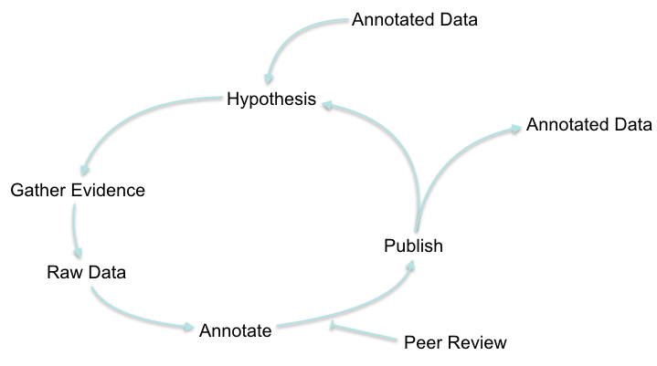
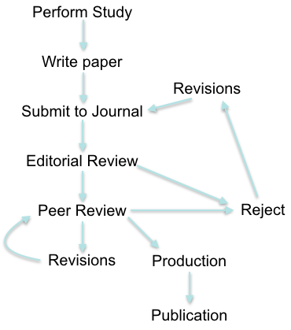

```{r setup, include=FALSE}
knitr::opts_chunk$set(echo = FALSE)
```

## Science and Communication

Science is discourse, that is to say, it is spoken and written and visual communication from one person to another or others/ldots the purpose of science is to communicate, inform, and convince people, to win them over to our way of thinking.

— Lee Ballentine

## Reproducible Research



## Peer Review



## Picking a Journal

The first step to publishing is to pick a journal.

- Considerations
    - Journal's scope
        - Audience
        - Level of specialization
        - Has it published articles similar to yours?
    - Restrictions imposed by the journal
        - Manuscript types
        - Manuscript topics
    - Journal's impact factor
    - Take care to choose a reputable journal
    
- Cost of picking the wrong journal
    - Time (median time from submission to publication is about 120 days)
    - Your intended audience may not ever see your publication
    
## Picking a Journal: Bioinformatics Journal

- About: "Its main focus is on new developments in genome bioinformatics and computational biology"
- Impact Factor: 5.766
- Topics: Genome analysis, Sequence analysis, Phylogenetics, Structural bioinformatics, Gene expression, Genetic and population analysis, Systems biology, Data and text mining, Databases and ontologies, Bioimage informatics.
- Format: use of Word or \LaTeX \ templates is mandatory

## Picking a Journal: Bioinformatics Journal

- Types:
    - Original Papers (7 pages): New research developments, no simulated data
    - Discovery Notes (4 pages): Biologically important discoveries using computational techniques, new discoveries only, experimental data favored
    - Application Notes (2 pages - 1300 words or 1000 words with 1 figure): Description of novel softare
    - Reviews (3-8 pages): Most reviews are commissioned, but 1 page submissions are accepted from new authors
	- Conference papers: Proposals for special issues are welcome
	- Letters to the Editor: Letters accepted on broad range of topics covered by journal, including works published in Bioinformatics

## Picking a Journal: BMC Genomics

- About: "BMC Genomics is an open access, peer-reviewed journal that considers articles on all aspects of genome-scale analysis, functional genomics, and proteomics."
- Impact Factor: 3.867
- Format: Double spaced Word, \LaTeX, or RTF file, including line and page numbers
- Types (universal 350 word abstract limit, but no mention of page limits): 
    - Research Article (page limits?): Original, primary research
    - Methodology Article: New experimental or computational method, test or procedure
    - Database Article: Novel biomedical database likely to be of broad utility
    - Software Article: Describe a tool likely to be of broad utility that represents a significant advance over previously published software
    - Reviews: No non-commissioned submissions will be accepted

## Picking a Journal: Tips

- Look in your bibliography for ideas
- Look through issues of other journals in your field
- Ask a librarian for ideas

## Deciding whether to reveiw an article

Some things to consider when asked to review an article:

- Do you understand what they are talking about?
- Do you find the topic interesting?
- Do you have any conflicts of interest?
- Do you have the time?

Don't worry so much about the prestige of the journal. Lower tier research needs to be reviewed, and you will probably publish plenty of articles in journals other than Nature and Science.

## When Reviewing

- Check journal guidelines, if there are any.
- Is it well written?
- Does the background support the hypothesis?
- Are the methods appropriate?
- Could I repeat this study using only this paper as a guide?
- Are the statistics appropriate?
- Have they left anything obvious out?
- Are the results clear?
- Does the discussion place things in context within the field?
- Are they over selling their results?
- Write your thoughts in the margins (some people like to use colored pens / highlighters).

## Preparing the Review

- Write a short summary of the manuscript.
- End the summary with your feelings on the merit of the manuscript (usually includes recommendation to accept, accept with minor revision, requires major revisions, or reject).
- Major revisions required
    - Treat in order that they appear in the manuscript.
    - Include page number, paragraph number, line number, etc\ldots
    - Be specific. Provide clear rational for the recommended change.
- Minor revisions suggested
    - Follows same format as major revisions.
    - This is where typos should be highlighted, but don't focus too much on editing. If the English is bad, recommend they pass it by a native speaker rather than trying to fix it yourself.

## Preparing the Review

Use non-judgemental language. Remember that you are evaluating the work, not the authors.

- Bad example: "This hypothesis is stupid."
- Better example: "This hypothesis is not the only explanation for the contradiction presented in the introduction. Specifically, one alternate explaination is\ldots"

## Responding to a Reviewer

Follow the same general outline as for giving a review.

- Be polite. Thank the editor and reviewers for their time.
- Include a very specific summary of exactly what changes you made when resubmitting.
- Include the reviewer's comments with your responses, complete with page number, paragraph, and line number of the actual change in the manuscript.

## Responding to a Reviewer

- Remember: peer review is a gift. If the reviewer (who is nearly always trying very hard to give an accurate, helpful review) doesn't understand it, neither will others. 
- You can disagree, as long as you explain yourself. Some additional explanation in the manuscript may be appropriate to aid understanding.
- If a reviewer's request doesn't impact the message, it may be wise to make the change even if you think it isn't important.
- Be absolutely certain that the changes you say you made correspond with the changes you actually made.
- If your manuscript is rejected, you still want to consider the changes recommended by the reviewer. I've received the same paper for review, with the same flaws, after having already rejected it from a different journal. It is not rare to be asked to review the same paper by different journals.

