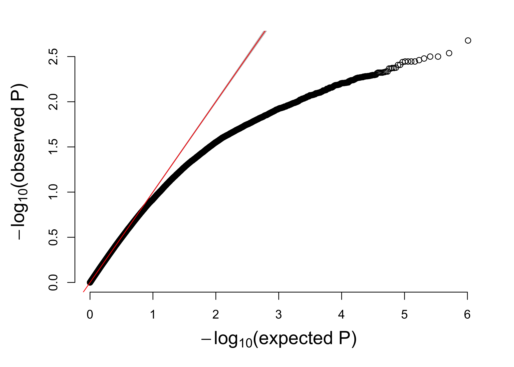
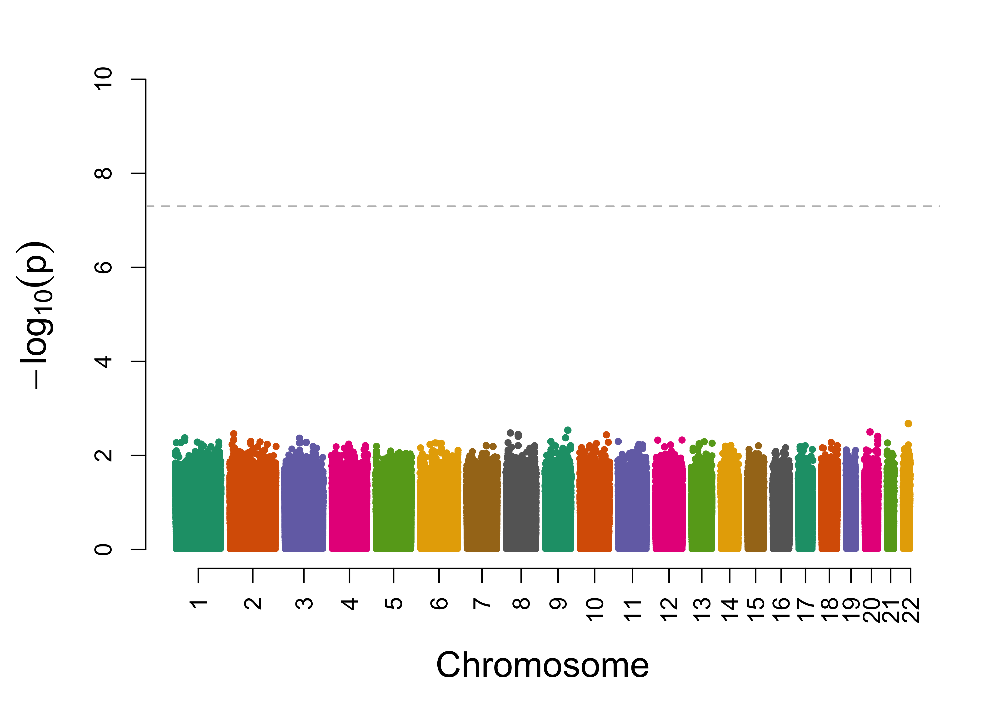

```{r setup, include=FALSE}
knitr::opts_chunk$set(echo = FALSE)

library(Rtools)
library(GWASTools)
library(SNPRelate)
library(tidyverse)
library(cowplot)
library(broom)
library(ggplot2)
library(stringr)

theme_update(text = element_text(size = 20))

# colorblind palette
cbbPalette <- c("#000000", "#E69F00", "#56B4E9", "#009E73", 
                "#F0E442", "#0072B2", "#D55E00", "#CC79A7")
```

## Setup

\small
```{r, eval = FALSE, echo = TRUE}
library(Rtools)
library(GWASTools)
library(SNPRelate)
library(tidyverse)
library(cowplot)
library(broom)
library(ggplot2)
library(stringr)

theme_update(text = element_text(size = 20))

# colorblind palette
cbbPalette <- c("#000000", "#E69F00", "#56B4E9", "#009E73", 
                "#F0E442", "#0072B2", "#D55E00", "#CC79A7")
```

## Sample data set

We aren't going to analyze these exact data, but this is what the each dataset will look like.

```{r modeling data}
n <- 400
set.seed(2893) # we aren't really going to analyze these data,
               # but this will give us an idea of what they look like
(dat <- data_frame(cont = rnorm(n),
                  cat = rbinom(n, 1, 0.5),
                  a = rbinom(n, 2, 0.4)))
```

## Additive traits

- Definition: The effect of each phenotype influencing variant changes the phenotype by an equal ammount for each inherited allele. Example: human skin color. It is unknown how many genes affect human skin color, but additivity is fairly well established.

```{r additive data}
set.seed(3945872)
dat <- data_frame(a = rbinom(n, 2, 0.4),
                  cat = rbinom(n, 1, ifelse(a == 0, 0.5,
                                     ifelse(a == 1, 0.667, 0.75))),
                  cont = rnorm(n, ifelse(a == 0, 0,
                                  ifelse(a == 1, 1.5, 3))))
```

```{r additive model, echo = TRUE}
glm(cat ~ (a == 1) + (a == 2), data = dat, family = binomial) %>%
    tidy() %>%
    mutate(OR = exp(estimate)) %>%
    select(term, OR, p.value)
```

## Multiplicitive traits

- Definition: The effect of each phenotype influencing variant changes the phenotype by a constant multiplier. For example, if one allele increases gene expression by 2 fold, two alleles will increase gene expression by 4 fold. Example: Hemoglobin A/S. Individuals with with a heterozygous hemoglobin phenotype (i.e. they have one A gene and one S gene) will experience very slight symptoms similar to sickle cell anemia. Individuals with two hemoglobin S genes will present with sickle cell disease. The effect of having two alleles is worse than double the symptoms in heterozygous individuals.

```{r multiplicitive data}
set.seed(394587)
dat <- data_frame(a = rbinom(n, 2, 0.4),
                  cat = rbinom(n, 1, ifelse(a == 0, 0.5,
                                     ifelse(a == 1, 0.667, 0.8))),
                  cont = rnorm(n, ifelse(a == 0, 0,
                                  ifelse(a == 1, 2, 4))))
```

\small
```{r multiplicitive model, echo = TRUE}
glm(cat ~ a, data = dat, family = binomial) %>%
    tidy() %>%
    mutate(OR = exp(estimate)) %>%
    select(term, OR, p.value)
```

## Multiplicitive traits

This is often called an additive model within the context of logistic regression, because at the log Odds scale, it is additive. At the OR scale, however, it is multiplicitive. Be sure to be very clear when defining your terms in the methods section.

- log Odds scale
$$ 
\begin{aligned}
\log(OR_1|a=1) &=   \beta_1 \\
\log(OR_1|a=2) &= 2*\beta_1 \\
               &= \beta_1 + \beta_1
\end{aligned}
$$

- Odds Ratio (OR) scale
$$
\begin{aligned}
(OR_1|a=1) &= e^{\beta_1} \\
(OR_1|a=2) &= e^{\beta_1 + \beta_1} \\
           &= e^{\beta_1} * e^{\beta_1}
\end{aligned}
$$

## Dominant traits

- Definition: The phenotype is observed if there are one or two variants. Example:  Polydactyly (extra fingers and toes) is a dominant trait caused by one of a number of different genes (e.g. GLI3). The allele frequency is about 2%.

```{r dominant data}
set.seed(394587)
dat <- data_frame(a = rbinom(n, 2, 0.4),
                  cat = rbinom(n, 1, ifelse(a == 0, 0.5, 0.667)),
                  cont = rnorm(n, ifelse(a == 0, 0, 1.5)))
```

```{r dominant model, echo = TRUE}
glm(cat ~ (a > 0), data = dat, family = binomial) %>%
    tidy() %>%
    mutate(OR = exp(estimate)) %>%
    select(term, OR, p.value)
```

## Recessive traits

- Definition: The phenotype is observed only if there are two variant alleles. Example: CCR5 $\Delta$ 32 homozygosity provides near perfect protection against HIV infection.

```{r recessive data}
set.seed(394587)
dat <- data_frame(a = rbinom(n, 2, 0.4),
                  cat = rbinom(n, 1, ifelse(a == 2, 0.667, 0.5)),
                  cont = rnorm(n, ifelse(a == 2, 1.5, 0)))
```

```{r recessive model, echo = TRUE}
glm(cat ~ (a == 2), data = dat, family = binomial) %>%
    tidy() %>%
    mutate(OR = exp(estimate)) %>%
    select(term, OR, p.value)
```

## X-linked traits

- Definition: Genes with recessive traits that are found on the X chromosome are X-linked. Males have only one X chromosome, so the presence of a recessive gene will not be compensated for by another chromosome inherited from the father. Because the gene is located on the X chromosome, males are more likely to be affected. Example: Hemophilia. Females with only one defective FVIII or FIX gene will still produce functional clotting factors in the blood stream, and the phenotype is not observed.

```{r xlinked data}
set.seed(394587)
dat <- data_frame(male = rbinom(n, 1, 0.5),
                  a = rbinom(n, ifelse(male, 1, 2), 0.4),
                  cat = rbinom(n, 1, ifelse(a == 2 | (a == 1 & male), 0.667, 0.5)),
                  cont = rnorm(n, ifelse(a == 2 | (a == 1 & male), 1.5, 0)))
```

\small
```{r xlinked model, echo = TRUE}
glm(cat ~ dummy, family = binomial,
    data = mutate(dat, dummy = a == 2 | 
                              (a == 1 & male))) %>%
    tidy() %>% 
    mutate(OR = exp(estimate)) %>%
    select(term, OR, p.value)
```

## Asside: Mosaic traits

- Definition: This is another type of X-linked trait, affecting females. In females, one X chromosome is essentially deactivated and forms what is called a Barr body. This happens relatively early in the development of the unborn offspring, and clonal expansions of daughter cells, all with the same X chromosome Barr body, will result in patches of similar X chromosome characteristics. Thus a gene affecting phenotype may be observable in patches. Example: Orange/black coat color in cats. Tortiseshell and Calico cats are always female.
    
## Background: Power

- By the Central Limit Theorem (CLT), the mean of your observed test distribution will be closer to the actual population mean as the sample size increases.
- By the Law of Large Numbers (LLN), the variance of your test distribution will get smaller as the sample size increases.

```{r sample distribution, fig.height=4}
data_frame(x = seq(from = -2, to = 2, length = 300),
           y1 = dnorm(x, sd = 1/sqrt(3)), # sample size of 3
           y2 = dnorm(x, sd = 1/sqrt(50))) %>% # sample size of 50
    ggplot() + 
    geom_line(aes(x, y1, linetype = 'n3')) +
    geom_line(aes(x, y2, linetype = 'n50')) +
    ylab("") +
    scale_linetype_manual(name = '', values = c(n3 = 1, n50 = 2), 
                          labels = c('n = 3', 'n = 50')) +
    theme(axis.text.x=element_blank(),
          axis.ticks.x=element_blank(),
          axis.text.y=element_blank(),
          axis.ticks.y=element_blank())
```

## Background: Power

The concept of statistical power comes into play when there is a null hypothesis to compare our test statistic against.

```{r population distn, fig.height=4}
data_frame(x = seq(from = -3, to = 4, length = 300),
           null = dnorm(x),
           alt = dnorm(x, mean = 1),
           altFill = ifelse(abs(x) > 1.96, alt, 0)) %>%
    ggplot() + 
    geom_line(aes(x, null, linetype = 'null')) +
    geom_line(aes(x, alt, linetype = 'alt')) +
    geom_area(aes(x, altFill), fill = rgb(0.2, 0.2, 0.2), alpha = 0.2) +
    ylab("") +
    scale_linetype_manual(name = '', values = c(null = 1, alt = 2), 
                          labels = c(null = 'Ho', alt = 'Actual')) +
    scale_x_continuous(breaks = c(-1.96, 1.96), labels = c("-2 SE", "2 SE")) +
    theme(axis.text.y=element_blank(),
          axis.ticks.y=element_blank())
```

Given these sampling distributions, what is the probability that we correctly reject the null hypothesis? This is statistical power.

## Background: Power and Sample Size

Now, we can increase the probability of correctly rejecting the null hypothesis if we increase the sample size.

- Why? Because the CLT and LLN are our friends!

```{r power, fig.height=4}
data_frame(x = seq(from = -3, to = 4, length = 300),
           null = dnorm(x, sd = 1/sqrt(20)),
           alt = dnorm(x, mean = 1, sd = 1/sqrt(20)),
           altFill = ifelse(abs(x) > 1.96 / sqrt(20), alt, 0)) %>%
    ggplot() + 
    geom_line(aes(x, null, linetype = 'null')) +
    geom_line(aes(x, alt, linetype = 'zalt')) +
    geom_area(aes(x, altFill), fill = rgb(0.2, 0.2, 0.2), alpha = 0.2) +
    ylab("") +
    scale_linetype_manual(name = '', values = c(null = 1, zalt = 2), 
                          labels = c(null = 'Ho', zalt = 'Actual')) +
    scale_x_continuous(breaks = c(-1.96, 1.96) / sqrt(20), labels = c("-2 SE", "2 SE")) +
    theme(axis.text.y=element_blank(),
          axis.ticks.y=element_blank())
```

## Power of Genetic Models

So, how much power do we have for different genetic models? How often will we be able to reject the null hypothesis when we should?

```{r correct add model}
maf <- seq(from = 0.01, to = 0.5, length = 300)
add <- data_frame(f2 = list(maf, maf, maf, maf),
                  or = 2,
                  n1 = c(20, 50, 100, 1000),
                  name = paste0('n', str_pad(n1, 4, pad = '0')),
                  n2.prop = 1,
                  pwr = list(NULL, NULL, NULL, NULL))

for(i in 1:dim(add)[1])
{
    add$pwr[[i]] <- 
        with(add, 
             MHadd.power(n1 = n1[i], f2 = f2[[i]], OR = or[i],
                         n2.prop = n2.prop[i]))$power
}
```

```{r correct dom model}
prop <- 1 - (1 - maf)^2
dom <- data_frame(p2 = list(prop, prop, prop, prop),
                  or = 2,
                  n1 = c(20, 50, 100, 1000),
                  name = paste0('n', str_pad(n1, 4, pad = '0')),
                  n2.prop = 1,
                  pwr = list(NULL, NULL, NULL, NULL))

for(i in 1:dim(dom)[1])
{
    dom$pwr[[i]] <- 
        with(dom, map(p2[[i]], 
                  ~ power.cont.tab(n1 = n1[i], p2 = .x, 
                                   OR = or[i],
                                   n2.prop = n2.prop[i])$power)) %>%
                  unlist()
}
```

```{r correct rec model}
prop <- maf^2
rec <- data_frame(p2 = list(prop, prop, prop, prop),
                  or = 2,
                  n1 = c(20, 50, 100, 1000),
                  name = paste0('n', str_pad(n1, 4, pad = '0')),
                  n2.prop = 1,
                  pwr = list(NULL, NULL, NULL, NULL))

for(i in 1:dim(rec)[1])
{
    rec$pwr[[i]] <- 
        with(rec, map(p2[[i]], 
                  ~ power.cont.tab(n1 = n1[i], p2 = .x, 
                                   OR = or[i],
                                   n2.prop = n2.prop[i])$power)) %>%
                  unlist()
}
```

```{r power curves, fig.height=6}
# set up plot list
p <- list(ggplot(), ggplot(), ggplot())

# create a list of power curve tibbles
dat <- list(add, dom, rec)
names(dat) <- c("Additive trait", 'Dominant trait', 'Recessive trait')

for(j in 1:3)
{
    for(i in 1:4)
    {
        p[[j]] <- p[[j]] + geom_line(aes(maf, power, color = name),
                                     size = 1.5, linetype = i,
                                     data = data_frame(maf = maf,
                                                       power = dat[[j]]$pwr[[i]],
                                                       name = dat[[j]]$name[i]))
    }

    # name the cbbPallette appropriately for custom colors
    names(cbbPalette)[1:4] <- c('n0020', 'n0050', 'n0100', 'n1000')

    p[[j]] <- p[[j]] + scale_color_manual(name = 'n',
                                          values = cbbPalette,
                                          labels = c(n0020 = 20, n0050 = 50,
                                                     n0100 = 100, n1000 = 1000)) +
                       xlab(names(dat)[j])
}

p[[4]] <- ggplot() +
          annotate("text", x = .5, y = .5, size = 8,
                   label = "OR = 2") +
          annotate("text", x = .5, y = .3, size = 8,
                   label = "alpha == 0.05",
                   parse = TRUE) +
          annotate("text", x = .5, y = c(0,.8), label = "") +
          xlab("") +
          ylab("") +
          theme(axis.text.x=element_blank(),
                axis.ticks.x=element_blank(),
                axis.text.y=element_blank(),
                axis.ticks.y=element_blank(),
                axis.line=element_blank())

plot_grid(plotlist = p)
```

## Creation of GDS files from PLINK output

```{r make gds, eval = FALSE, echo = TRUE}
# Create binary plink files
#  looks for: ASW.ped and ASW.map
#  creates: 'plink.bed', 'plink.bim', 'plink.fam'
system('plink --file ASW --make-bed --noweb')

# R package will expect gzipped files
system('gzip plink.*')

# Convert to GDS
snpgdsBED2GDS('plink.bed.gz', 'plink.fam.gz',
              'plink.bim.gz', 'ASW.gds', 
              family=TRUE, cvt.chr="int", 
              cvt.snpid="int", verbose=FALSE)
```

## Merging GDS files

```{r GDS prep1, echo = TRUE, eval = FALSE}
snpgdsCombineGeno(paste0('~/Documents/HapMap3/gds/', 
                         c('CHB', 'CHD'), '.gds'),
                  '~/Documents/HapMap3/gds/CH.gds')

## Create ~/Documents/HapMap3/gds/CH.gds 
##        with 169 samples and 1258957 SNPs
##    Open the gds file ~/Documents/HapMap3/gds/CHB.gds.
##        0 strands of SNP loci need to be switched.
##    Open the gds file ~/Documents/HapMap3/gds/CHD.gds.
##        46997 strands of SNP loci need to be switched.
```

## Opening GDS files
\small
```{r gds prep2, echo = TRUE, eval = FALSE}
(gds <- GdsGenotypeReader('~/Documents/HapMap3/gds/CH.gds'))

## File: /Users/johnsonra/Documents/HapMap3/gds/CH.gds (59.6M)
## +    [  ] *
## |--+ sample.id   { Str8 169 ZIP_ra(27.7%), 381B }
## |--+ snp.id   { Str8 1258957 ZIP_ra(34.9%), 4.3M }
## |--+ snp.position   { Int32 1258957 ZIP_ra(81.7%), 3.9M }
## |--+ snp.chromosome   { Int32 1258957 ZIP_ra(0.10%), 4.9K }
## |--+ snp.allele   { Str8 1258957 ZIP_ra(14.1%), 692.8K }
## \--+ genotype   { Bit2 1258957x169, 50.7M } *
```

## Adding Sample Annotations

\small
```{r gds prep3, echo = TRUE}
gds <- GdsGenotypeReader('~/Documents/HapMap3/gds/CH.gds')
# Be sure clinical data agrees with GDS file
load('../project1/dat4.RData')

dat4 <- filter(dat4, IID %in% getVariable(gds, 'sample.id')) %>%
        rename(scanID = IID) %>%
        right_join(data_frame(scanID = 
                              getVariable(gds, 'sample.id'))) %>%
        as.data.frame()
close(gds)
```

## Run Logistic Regression

\small
```{r logistic, echo = TRUE, eval = FALSE}
geno <- GenotypeData(data = gds, 
                     scanAnnot = ScanAnnotationDataFrame(dat4))

# get chromosome number (only analyze autosomes here)
chr <- getVariable(gds, 'snp.chromosome')

out <- assocRegression(geno, 'hiv', model.type = 'logistic',
                       gene.action = 'additive',
                       covar = c('multiple_partners', 
                                 'share_needles',
                                 'protected_sex'),
                       snpStart = 1, 
                       snpEnd = max(which(chr < 23)))

## Reading in Phenotype and Covariate Data...
## Running analysis with 84 Samples
## Beginning Calculations...
## Block 1 of 245 Completed - 19.4 secs
## Block 2 of 245 Completed - 14.24 secs
## Block 3 of 245 Completed - 14.91 secs
## ...
```

```{r logistic hidden, results = 'hide', warning = FALSE}
geno <- GenotypeData(data = GdsGenotypeReader('~/Documents/HapMap3/gds/CH.gds'),
                     scanAnnot = ScanAnnotationDataFrame(dat4))

out <- assocRegression(geno, 'hiv', model.type = 'logistic',
                       gene.action = 'additive',
                       covar = c('multiple_partners', 
                                 'share_needles',
                                 'protected_sex'),
                       snpStart = 1, snpEnd = 100)
close(geno)
```

## Logistic Regression Output

\small
```{r logistic out1, echo = TRUE}
load('../Data/15_logisticOut1.RData')
str(out)
```

## Logistic Regression Output

\small
```{r logistic out2, echo = TRUE, fig.height=4}
summary(-log10(out$Wald.pval))
hist(out$Wald.pval)
```

## Logistic Regression Output

```{r logistic out3a, eval = FALSE}
png('../Images/15_qq1.png', width = 7, height = 5, res = 600, units = 'in')
par(mar = c(5,5,2,2) + .1)
qqPlot(out$Wald.pval, bty = 'n', cex.lab = 1.5)
dev.off()
```

```{r logistic out3b, echo = TRUE, eval = FALSE}
qqPlot(out$Wald.pval)
```



## Logistic Regression Output

```{r logistic out4a, eval = FALSE}
png('../Images/15_manhattan1.png', width = 7, height = 5, res = 600, units = 'in')
par(mar = c(5,5,2,2) + .1)
manhattanPlot(out$Wald.pval, out$chr, bty = 'n', cex.lab = 1.5)
dev.off()
```

```{r logistic out4b, echo = TRUE, eval = FALSE}
manhattanPlot(out$Wald.pval, out$chr)
```



## Logistic Regression Output

```{r logistic out5, echo = TRUE}
arrange(out, Wald.pval)[1:10,] %>%
    select(snpID, chr, Est, Wald.pval)
```

## Run Survival Analysis

\small
```{r survival, echo = TRUE}
gds <- GdsGenotypeReader('~/Documents/HapMap3/gds/CH.gds')
geno <- GenotypeData(data = gds, 
            scanAnnot = {mutate(dat4, 
                         thiv = ifelse(thiv > 0, thiv, NA)) %>%
                         ScanAnnotationDataFrame()})

out2 <- assocCoxPH(geno, event = 'hiv',
                   time.to.event = 'thiv',
                   gene.action = 'additive',
                   covar = c('multiple_partners', 
                             'share_needles',
                             'protected_sex'),
                   snpStart = 1, snpEnd = 100)
```

## Survival Analysis Output

We only ran the first 100 here, but you will use the output techniques above for survival analysis as well (note that we will use `z.pval`, though).

```{r survival output}
arrange(out2, z.pval)[1:10,] %>%
    select(snpID, chr, Est, z.pval)
```

## Survival Analysis Output

This only has 100 data points, but for the full plot you probably want to save it to a png.

```{r surv out2}
par(mar = c(5,5,2,2) + .1)
qqPlot(out2$z.pval, bty = 'n', cex.lab = 1.5)
```

## Significance Threshold

If I pulled a coin out and flipped 10 heads in a row, would you be impressed?

```{r ten heads, echo = TRUE}
set.seed(6107)

rbinom(n = 10, size = 1, prob = 0.5)

# probability:
0.5^10
```

## Fishing Experiment

What really happend:

```{r fishing, echo = TRUE, eval = FALSE}
set.seed(9382)
randomSeeds <- round(runif(1000) * 10000)

for(s in randomSeeds)
{
    set.seed(s)
    heads <- sum(rbinom(n=10, size=1, prob=0.5))
    if(heads == 10)
        break
}
s
## [1] 6107
```

## Type I and Type II Errors

Probability of making a Type I error (i.e. incorrectly rejecting the null hypothesis when it is true\ldots i.e. calling something significant when it isn't):

$$ 1 - (1 - \alpha)^n $$

when there are $n$ tests in your study.

## Type I and Type II Errors

Applying this formula to our regression results, the probability of a Type I error is:

\begin{center}
\begin{tabular}{cr}
$\alpha$           & Error Rate \\ \hline
0.05               & >0.999 \\
$1 \times 10^{-5}$ & >0.999 \\
$1 \times 10^{-6}$ &  0.705 \\
$1 \times 10^{-7}$ &  0.115 \\
$5 \times 10^{-8}$ &  0.059 \\
$1 \times 10^{-8}$ &  0.012
\end{tabular}
\end{center}

## Bonferroni Corrections

A simple approximation to put a p-value into perspective with the family-wise Type I error rate is:

$$ p_{corrected} = p*n $$

or

$$ \alpha_{study~wide} = \frac{\alpha}{n}. $$

So, our Bonferroni-corrected significance threshold would be

$$ \frac{0.05}{1,220,353} \approx 4.1\times10^{-8} $$

## Declaring Significance

People often get hung up on what the significance threshold should be for their study. A Bonferroni correction is probably too conservative in most instances, but what threshold should you use?

If your results are close enough to the Bonferroni significance threshold that you are wondering if you can squeeze a little extra statistical power out of your analysis, then they probably aren't that exciting to begin with. They very well might be publishable, though! Share what you have found, *and let others know exactly what you did.*

## What can you do if you lack power?

Power can be thought of as the probability that you will be able to reject the null hypothesis when you should. Not rejecting the null hypothesis when you should is called a Type II error.

So, what can you do if you lack statistical power? What can you do when you have little hope of being able to reject the null hypothesis when the alternate hypothesis is true?

- Give up and move onto something else.
- Collect more data (design your studies to avoid this).
- Publish what you have an hope someone else (perhaps you) will be able to replicate your results in another study.
