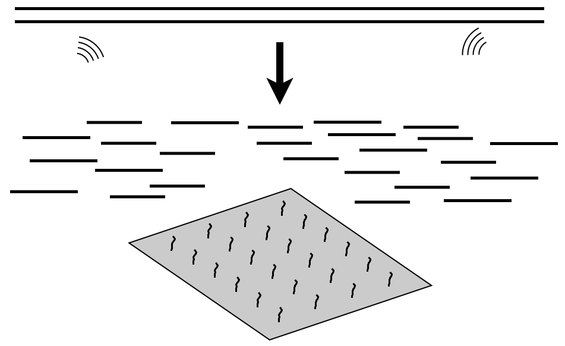
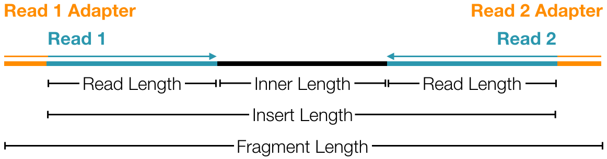
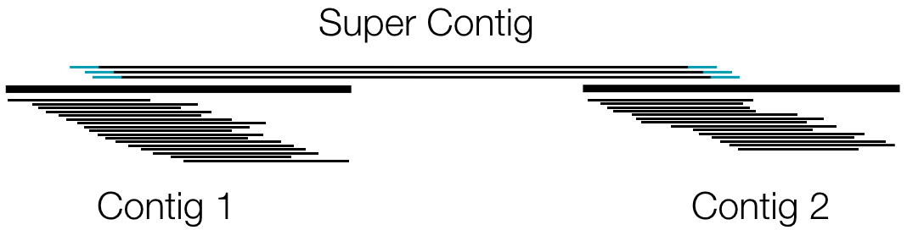

```{r setup, include=FALSE}
knitr::opts_chunk$set(echo = FALSE)
```

## Overview

- This is a very quick, incomplete, high-level overview of sequence analysis.
- There are many flavors of Next-Generation Sequencing (NGS).
- An attempt has been made here to at least point you in the right direction for different NGS analysis strategies.

## Genetic Association Studies

- Family studies
    - First disease-causing gene identified: CFTR (1985)
    - High linkage disequilibrium allows for coverage of the entire genome with hundreds to a few thousand genetic markers.
    - Powerful, but limited to study of Medelian traits.

- Population studies
    - Moderate linkage disequilibrium allows for coverage of the entire genome with hundreds of thousands to a million genetic markers.
    - Less powerful due to large sample size required to ofset high multiple comparison burden.
    - Retains ability to search for genetic contributions to complex disease.

- When a disease *associated* region is identified, targeted sequencing is required to identify disease *causing* variants.

## Statistics vs Data Science

- Statistical evidence requires repeated sampling of a population.
- Three factors make obtaining appropriately sized samples difficult in NGS applications.
    - The number of statistical comparisons for GWAS data is ~1 million. This grows significantly larger when analyzing whole genome data.
    - The statistical power for analysis of rare variants is vanishingly small.
    - The cost of obtaining NGS data, while constantly dropping, is still prohibitive.
- Taking these factors into account, there isn't much statistical evidence to be obtained in most NGS studies, but there can still be significant learning.

## Study Design Considerations: Coverage

- 2x coverage may be appropriate for a population survey of common variation.
- 30-40x coverage is sufficient for most NGS applications. This level of resolution allows for clear genotpying of most of the genome.
- 100x or greater coverage may be necessary for cancer sequencing, since you are samping a heterogeneous population of cells. Estimation of the frequency of different variants and positive identification of uncommon variants in this population requires more data.

$$
\begin{aligned}
\uparrow \mbox{coverage} ~=~ \uparrow \mbox{cost} ~=~ \downarrow \mbox{samples}
\end{aligned}
$$

## Study Design Considerations: Exome

- Exome capture allows the sequencing of 1% of the genome (about 30 Mbp).
- This captures about 180,000 exons.



## Aside: What is an exon?

- An exon is the part of a gene that is transcribed into the mature mRNA sequence that is used to encode proteins ("The important stuff" is probably not the best description of this, but we understand it best).
- Not all exons are included in every transcript.

](../Images/16_exon.png)

## Sequence Fragments

- Adapters are added to the ends to aid in the sequencing process.
    - Barcodes can also be added to identify individuals.
- The reads (not always paired as shown here) are the parts we are interested in.



## Mapping Sequence Reads

There are very good reference genomes to which we can map sequence for a number of organisms.


## Alignment of Sequence Reads

Before a reference genome is established, alignement of sequence reads is necessary.

- Contigs are inferred using short inserts.
- Supercontigs (sometimes called scaffolds) are established using longer inserts.
- This supercontig only has two contigs, but many more can be pieced together this way.



## Multiple Sequence Alignment

Multiple sequence alignment can be used to infer gene location and function when sequencing new organisms. This can also be a powerful tool to identify species (e.g. in microbiome studies).

\begin{centering}
\begin{figure}
\includegraphics[height=2in]{../Images/16_multipleSequenceAlignment.png}
\caption{First 90 positions of a protein multiple sequence alignment of instances of the acidic ribosomal protein P0 (L10E) from several organisms. Generated with ClustalX. (\href{https://commons.wikimedia.org/w/index.php?curid=3930704}{Image courtesy of Wikipedia})}
\end{figure}
\end{centering}

## GATK

- The Genome Annotation Took Kit (GATK) was developed at the Broad Institute with the purpose of offering a best practices approach to variant discovery and genotype inference from NGS data.
- While some software is provided, it is a tool kit with work flow recommendations rather than a black box that accepts raw data and gives you annotated data.
- Documentation can be found on the GATK website (extensive for Whole Genome/Exome workflow, less well documented for other workflows).
- Current version of the tool kit is 3.7

](../Images/16_GATK.png)

## GATK WG/Exome Workflow

](../Images/16_GATKvariantWorkflow.png)

## Pre-Processing

- You usually get raw reads right off the machine in a fastq file.
- Some sequencing services will give you a bam file, which may or may not have been aligned.
- Depending on your relationship with the service and how much documentation they give you, a significant amount of QC may need to be done.
- Once you have a good data set to work with, you can begin mapping of your reads.

## Pre-Processing

1) GATK generally recommends `BWA` for mapping of reads. It is fast and does a reasonable job, but there may be a better option for some sequencing platforms.
2) GATK recommneds using `Picard` to mark duplicates.
    - Duplicate reads usually arise from sequencing of the same fragment multiple times. Thus, they offer no added information, and can actualy bias your downstream analysis if not properly accounted for.
    - "Properly accounted for" can be replaced with "ignored" in most cases.
    - You probably want to skip this step if your protocol uses amplicons or some other method that results in all sequences starting/stopping at the same location.

## Pre-processing

3) The unique mapped reads are now ready for GATK's base recallibration tool.
    - This updates the quality scores of each base call.
    - These scores are relied upon during the variant calling phase, so it is important to get them as accurate as possible.
    - The algorithm builds a model based on what it expects to see, using the reference genome and known population variation into account.
    - Recalibration of the quality scores is done based on this model.
    - You can also build a second model to view the before and after scores for QC purposes (recommended).

## Variant Discovery

- We are now ready to call variants.
- Our aim is to balance
    - Sensitivity: Our ability to identify real variants, and
    - Specificity: Our ability to discern and discard artifacts from sequencing and mapping.
- Variant discovery steps are optimized to maximize sensitivity.
- The filtering step can be optimized, depending on your study aims, to apply a reasonable amount of specificity.

## Variant Discovery

1) Call variants for each sample.
    - Variant calling using GATK's `HaplotypeCaller` does a local de-novo assembly around regions containing probable variants (throwing out mapping information).
    - The idea is to use mapping to get the reads close to where they should be and assemble the reads belonging to that region into haplotypes.
    - This results in much more accurate variant calls and allows for simultaneous SNP and Indel calling.
2) Joint genotyping of the entire cohort.
    - `GenotypeGVCFs` is used to jointly call genotypes in the entire corhort.
    - This quickly summarizes and formats the cohort data for downstream analysis.
    
## Variant Discovery

3) Filter variants.
    - Filtering using variant quality score recalibration (VQSR) uses a sophisticated machine learning algorithm.
    - VQSR requires at least 30 exomes or 2 whole genomes to work properly.
    - VQSR also requires highly curated data sets as reference.
    - Manual development of filtering parameters is needed if VQSR requirements are not met.

## Callset Refinement

- Additonal refinements might be available (but certainly not required), depending on your dataset and study design. The following can be used to further refine your variant calls:
    - Known population frequencies
    - Pedigree information
    - Annotations of known variant characteristics
    - Annotations of predicted variant characteristics
    
## Callset Refinement

- Genotype Refinement can make use of known population frequencies to provide another filter to weed out bad variant calls.
    - You will likely loose some rare variants, but you will also have higher certainty in the quality of your genotype calls.
- Variant annotation can be done using any of the following:
    - `AVIA` (https://avia-abcc.ncifcrf.gov)
    - `VariantAnnotator` (GATK)
    - `Oncotator` (GATK)
    - `SnpEff` (http://snpeff.sourceforge.net)
    - `Annovar` (http://annovar.openbioinformatics.org)

## Variant Evaluation

Variant evaluation and analysis is beyond the scope of this brief overview, but GATK has some nice documentation to give you an idea of where to start ([click here](https://software.broadinstitute.org/gatk/best-practices/bp_3step.php?case=GermShortWGS)).

## RNA Sequence

- mRNA: Messenger RNA is typically sequenced when we want to measure gene expression.
    - This contains the exons that are to be translated into protein sequence.
    - PolyA selection
- Total RNA: mRNA makes up a small portion of the total RNA in a cell.
    - This will contain other transcripts like Transfer RNA (tRNA), Ribosomal RNA (rRNA) and other RNA fragments that may or may not have a function in the cell.
    - Silencing RNA (siRNA) is not captured well in this application due to their short length.
- Targeted capture of RNA specific to your study interests can be used to enrich for more specific control over the output.

## RNA Sequence

- RNA sequence often comes in the form of unpaired reads (espeically for short RNAs). Paired RNA-Seq reads can be useful for:
    - Detecting gene fusions in cancer
    - Characterizing novel splice isoforms
- The GATK workflow is focused on variant discovery.
- Other workflows exist for gene expression.

## GATK RNA Workflow

](../Images/16_GATKrnaWorkflow.png)

## Other Workflows

- Alternate workflows exist for gene expression and other RNA-seq applications.
- One source of workflows is Bioconductor (see https://www.bioconductor.org/help/workflows/).
    - The [RNA-seq Workflow](https://www.bioconductor.org/help/workflows/rnaseqGene/), for example, takes you from the pre-processing step in the GATK RNA workflow through analysis and visualization of differentially expressed genes.

## Mapping Cancer Sequence

- When sequencing cancer samples, a tumor and a normal pair are required for best results.
- Some applications can take tumor only samples, but they nearly always work better with a paired normal sample.
    - Analysis of somatic mutations (differences from germline)
    - Analysis of microsatellite instability (MSI)
    - Analysis of gene fusions
    
## GATK Somatic Workflow

](../Images/16_GATKsomaticWorkflow.png)
