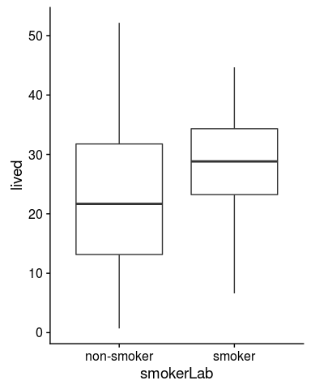

Introduction
------------

You may find a [these basic probability
concepts](https://github.com/BIFXapps/BIFX553/blob/master/Labs/ProbabilityConcepts.pdf)
to be helpful before continuing on.

To get a better idea of different types of bias and how they might
affect our analyses, we are going to generate and explore some biased
data sets. Remember, a statistic is biased when the difference between
your estimator's expected value and it's true value is non-zero. You can
think of it in terms of target practice.

As you can see in Figure , as bias increases, the placement of our
estimates is not centered on the bull's eye. Likewise, when our
statistics are not centered on the true population parameters we are
trying to estimate, we are experiencing bias.

### Confounding

Confounding occurs when there is a difference in frequency of the
outcome in two populations, irrespective of the exposure.

In this case, our bias can make something look associated with the
outcome when it isn't, or it can even cause the association to go in the
opposite direction than expected. This is what happened in the example I
shared in this week's module.

    # Smoking confounded by age
    # This study samples women aged 20 - 65 and tracks how long they live after study entry
    # because older women are less likely to be smokers, it appears that smokers live longer
    require(dplyr)

    n <- 200 # sample size

    set.seed(2346)
    dat <- data_frame(age = runif(n, min = 20, max = 65), # age ranges between 20 and 65
                      smoker = rbinom(n, size = 1, # smoker is more likely w/ younger age
                                      prob = ifelse(age > 50, .05, 
                                             ifelse(age > 40, .1,
                                             ifelse(age > 30, .5, .9)))),
                      smokerLab = ifelse(smoker, 'smoker', 'non-smoker'),
                      death = ifelse(smoker, rnorm(n, 57, 5), # age of death
                                             rnorm(n, 70, 5)),
                      lived = death - age) %>% # years lived after start of study
           filter(lived > 0) # never observed these individuals

    # look at how long they lived as a function of other variables
    ggplot(dat, aes(smokerLab, lived)) +
        geom_boxplot()

    # look at a t-test comparing the two
    with(dat, t.test(lived[smoker == 0], lived[smoker == 1]))

    ## 
    ##  Welch Two Sample t-test
    ## 
    ## data:  lived[smoker == 0] and lived[smoker == 1]
    ## t = -3.0942, df = 173.19, p-value = 0.002302
    ## alternative hypothesis: true difference in means is not equal to 0
    ## 95 percent confidence interval:
    ##  -7.789814 -1.722181
    ## sample estimates:
    ## mean of x mean of y 
    ##  23.15725  27.91325

### Recall bias

Recall bias occurs when the time since exposure affects how the exposure
is measured.

For example, an individual's recollection of how often they took a
multivitamin 20 years ago could be quite different than what actually
happened.

#### Problem 1

We would like to study the effect of dietary supplements on cancer
incidence. Consider the following:

-   Multivitamin use has slightly decreased over the past 20 years from
    37% in 1999 to about 30% today.
-   Supervitamin use has increased over the past 20 years from 17% in
    1999 to about 24% today.
-   The use of both multivitamins and supervitamins has increased from
    2% in 1999 to about 4% today.
-   The incidence of cancer among the population under study is about
    20%.
-   Cancer incidence is not associated with multivitamin use.
-   Cancer incidence among subjects who used supervitamins over the past
    20 years about twice as high as those who didn't take any
    supervitamins, and incidence is about 1.5 times as high in subjects
    who took supervitamins inconsistently (i.e. they used to take them
    or they take them now, but not both).
-   The probability of current multivitamin use is 75% if they took
    multivitamins in 1999.
-   The probability of current supervitamin use is 95% if they took
    supervitamins in 1999.
-   The correct recollection of an individual that they took a dietary
    supplement in 1999 is 90% if taking one now and 50% if they used to
    take a supplement and are not taking one now. Otherwise they have a
    25% probability of incorrectly reporting taking a dietary
    supplement.

Do the following:

-   Create a DAG to model this scenario.
-   Predict what the effect on our outcome will be.
-   Simulate a data set of 500 individuals that match this scenario
    using the code below.
-   What is the observed effect on our outcome?

<!-- -->

    n <- 200

    set.seed(293478)
    vitamins <- data_frame(# Actual
                           mlti99 = rbinom(n, 1, ),
                           supr99 = ifelse(mlti99, rbinom(n, 1, ),
                                                   rbinom(n, 1, )),
                           mlti18 = ifelse(mlti99, rbinom(n, 1, ),
                                                   rbinom(n, 1, )),
                           supr18 = ifelse(supr99, rbinom(n, 1, ),
                                                   rbinom(n, 1, )),
                           cancer = ifelse(supr99 & supr18, rbinom(n, 1, 2  *),
                                    ifelse(supr99 | supr18, rbinom(n, 1, 1.5*),
                                                            rbinom(n, 1,     ))),
                           # Observed
                           mlti_recall = ifelse(mlti18 & mlti99, rbinom(n, 1, ),
                                         ifelse(         mlti99, rbinom(n, 1, ),
                                                                 rbinom(n, 1, ))),
                           supr_recall = ifelse(supr18 & supr99, rbinom(n, 1, ),
                                         ifelse(         supr99, rbinom(n, 1, ),
                                                                 rbinom(n, 1, )))) %>%
        
                # add low/high risk variables for our two comparison groups
                mutate(lowRisk = !supr99 & !supr18,
                       highRisk = supr99 &  supr18,
                       obsLow = !supr_recall & !supr18,
                       obsHigh = supr_recall &  supr18)

    # look at vitamins data set
    vitamins

    ## # A tibble: 200 x 11
    ##    mlti99 supr99 mlti18 supr18 cancer mlti_… supr… lowR… high… obsL… obsH…
    ##     <int>  <int>  <int>  <int>  <int>  <int> <int> <lgl> <lgl> <lgl> <lgl>
    ##  1      0      1      0      1      0      0     1 F     T     F     T    
    ##  2      0      1      0      1      1      0     0 F     T     F     F    
    ##  3      1      0      1      0      0      1     1 T     F     F     F    
    ##  4      0      1      0      1      0      0     1 F     T     F     T    
    ##  5      1      0      1      0      0      1     0 T     F     T     F    
    ##  6      0      1      0      1      0      0     1 F     T     F     T    
    ##  7      0      0      0      0      0      0     0 T     F     T     F    
    ##  8      0      1      0      1      0      0     1 F     T     F     T    
    ##  9      0      1      0      1      0      0     1 F     T     F     T    
    ## 10      0      0      0      1      0      0     0 F     F     F     F    
    ## # ... with 190 more rows

    # compare tables
    with(vitamins, table(supr99, supr18)) / n

    ##       supr18
    ## supr99     0     1
    ##      0 0.765 0.045
    ##      1 0.005 0.185

    with(vitamins, table(supr_recall, supr18)) / n

    ##            supr18
    ## supr_recall    0    1
    ##           0 0.54 0.07
    ##           1 0.23 0.16

    # compare statistics for low risk and high risk groups
    with(filter(vitamins, lowRisk | highRisk),
         # (swap columns to put cancer outcome in first column)
         table(lowRisk, cancer)[,2:1]) %>% 
         prop.test()

    ## 
    ##  2-sample test for equality of proportions with continuity
    ##  correction
    ## 
    ## data:  .
    ## X-squared = 4.3756, df = 1, p-value = 0.03646
    ## alternative hypothesis: two.sided
    ## 95 percent confidence interval:
    ##  -0.01608845  0.32133487
    ## sample estimates:
    ##    prop 1    prop 2 
    ## 0.2702703 0.1176471

    # compare statistics for observed low risk and observed high risk groups
    with(filter(vitamins, obsLow | obsHigh),
         # (swap columns to put cancer outcome in first column)
         table(obsLow, cancer)[,2:1]) %>% 
         prop.test()

    ## Warning in prop.test(.): Chi-squared approximation may be incorrect

    ## 
    ##  2-sample test for equality of proportions with continuity
    ##  correction
    ## 
    ## data:  .
    ## X-squared = 0.46243, df = 1, p-value = 0.4965
    ## alternative hypothesis: two.sided
    ## 95 percent confidence interval:
    ##  -0.1016319  0.2358911
    ## sample estimates:
    ##    prop 1    prop 2 
    ## 0.1875000 0.1203704

### Collider stratification bias

For the last example, we will explore an example of collider
stratification bias. Recall the [Whitcomb
2009](https://www.ncbi.nlm.nih.gov/pmc/articles/PMC2743120/pdf/nihms-135847.pdf)
study which found the smoking status of mothers to be associated with
decreased infant mortality.

#### Bonus Challenge Problem

-   Draw a DAG of this model.
-   Simulate a data set that replicates the findings of the Whitcomb
    paper.
    -   Assume that babies born to mothers who smoke have a 1% mortality
        rate.
    -   Assume that other under-weight babies in the data set have other
        unmeasured conditions that result in 5% mortality rate.
    -   Assume all babies sampled are under-weight, and 30% are born to
        mothers who smoke.
    -   Make your sample size 10,000.
-   How would your findings change if you were missing key variables
    from this analysis?
