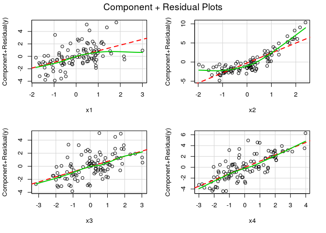
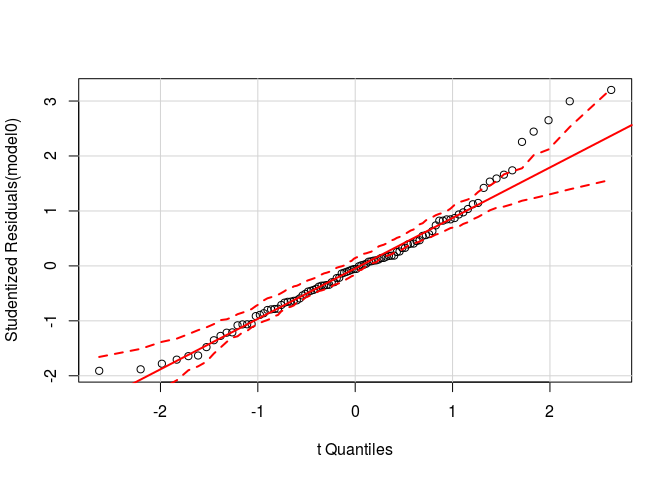
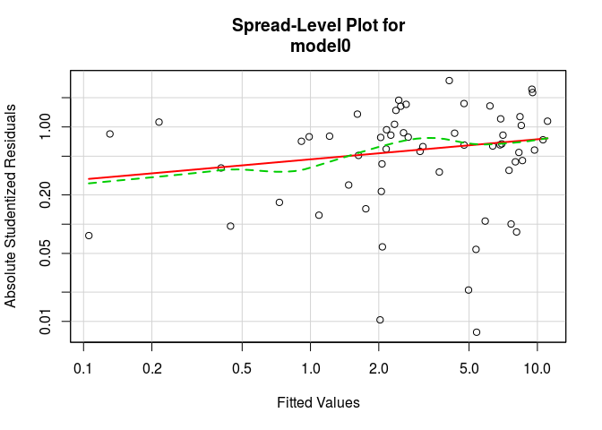

Linear Regression Assumptions
-----------------------------

This week we will practice testing and correcting model assumptions for
linear models. Each of the data sets we will practice with have
different problems that you will need to sort out.

Example
-------

In this toy example, we have a variable with a non-linear relationship,
as well as a couple of variables that are more or less strongly
correlated. Note how the tests of our assumptions are affected by these
violations.

    require(tidyverse)

    # the data
    n <- 500

    set.seed(23497)
    dat <- data_frame(x1 = rnorm(100),
                      x2 = rnorm(100),
                      x3 = x1 + rnorm(100),
                      x4 = x3 + rnorm(100),
                      y = x1 + 2*x2 + x2^2 + x3 + x4 + rnorm(100))

    # first model
    model0 <- lm(y ~ x1 + x2 + x3 + x4, data = dat)

    # test for linearity
    crPlots(model0)

    # test for multivariate normality
    require(broom)
    with(augment(model0), shapiro.test(.std.resid))

    ## 
    ##  Shapiro-Wilk normality test
    ## 
    ## data:  .std.resid
    ## W = 0.96648, p-value = 0.01196

    qqPlot(model0)

    # test for multicollinearity
    vif(model0)

    ##       x1       x2       x3       x4 
    ## 1.774338 1.063819 3.665218 2.828375

    # test for autocorrelation
    durbinWatsonTest(model0)

    ##  lag Autocorrelation D-W Statistic p-value
    ##    1      0.07011517      1.857625     0.5
    ##  Alternative hypothesis: rho != 0

    # test for homoscedasticity
    ncvTest(model0)

    ## Non-constant Variance Score Test 
    ## Variance formula: ~ fitted.values 
    ## Chisquare = 0.2710789    Df = 1     p = 0.602609

    spreadLevelPlot(model0)

    ## Warning in spreadLevelPlot.lm(model0): 41 negative fitted values removed

    ## 
    ## Suggested power transformation:  0.7937753

This model looks nicer:

    model1 <- lm(y ~ x1 + identity(x2^2) + x4, data = dat)

    # a couple of tests
    crPlots(model1)

    with(augment(model0), shapiro.test(.std.resid))

    ## 
    ##  Shapiro-Wilk normality test
    ## 
    ## data:  .std.resid
    ## W = 0.96648, p-value = 0.01196

    vif(model1)

    ##             x1 identity(x2^2)             x4 
    ##       1.381205       1.004667       1.385173

    # final model results
    summary(model1)

    ## 
    ## Call:
    ## lm(formula = y ~ x1 + identity(x2^2) + x4, data = dat)
    ## 
    ## Residuals:
    ##     Min      1Q  Median      3Q     Max 
    ## -5.8918 -1.0031  0.3043  1.5051  4.3659 
    ## 
    ## Coefficients:
    ##                Estimate Std. Error t value Pr(>|t|)    
    ## (Intercept)     -0.4035     0.3023  -1.335    0.185    
    ## x1               1.2586     0.2842   4.428 2.52e-05 ***
    ## identity(x2^2)   1.6148     0.1981   8.150 1.36e-12 ***
    ## x4               1.8210     0.1794  10.151  < 2e-16 ***
    ## ---
    ## Signif. codes:  0 '***' 0.001 '**' 0.01 '*' 0.05 '.' 0.1 ' ' 1
    ## 
    ## Residual standard error: 2.364 on 96 degrees of freedom
    ## Multiple R-squared:  0.7685, Adjusted R-squared:  0.7613 
    ## F-statistic: 106.2 on 3 and 96 DF,  p-value: < 2.2e-16

Plant Growth
------------

Use the PlantGrowth dataset in R to model the effect of two treatments
on the growth of plants.

-   What is the average difference between each treatment and the
    control group?
-   What is the average difference between the two treatment groups?

<!-- -->

    data("PlantGrowth")

Simulated glomerular filtration rate
------------------------------------

In this simulated data set, we are going to explore glomerular
filtration rate as a function of age, gender and blood pressure. The
gist sourced below will create a data set called `dat`.

-   Draw a DAG describing your understanding of this system,
-   Create a statistical model,
-   Check your model assumptions and revise accordingly.

<!-- -->

    source('https://tinyurl.com/y78ws8gk')

Height and weight
-----------------

Here we revisit the Howell data set from a couple of weeks ago.

-   Draw a DAG describing your understanding of this system,
-   Create a statistical model,
-   Check your model assumptions and revise accordingly.

<!-- -->

    howell1 <- read_delim('https://raw.githubusercontent.com/rmcelreath/rethinking/master/data/Howell1.csv', ';') %>%
        mutate(sex = ifelse(male, 'male', 'female'))

    ## Parsed with column specification:
    ## cols(
    ##   height = col_double(),
    ##   weight = col_double(),
    ##   age = col_double(),
    ##   male = col_integer()
    ## )

Bonus Challenge Problem - Motor Trend Car Road Tests
----------------------------------------------------

These data were extracted from the 1974 *Motor Trend* US maagzine, which
we will use to predict expected miles/gallon for cars, given other
statistics about the car.

-   Draw a DAG describing your understanding of the system,
-   Create a staistical model,
-   Check your model assumptiosn and revise accordingly.

<!-- -->

    data("mtcars")
    ?mtcars
