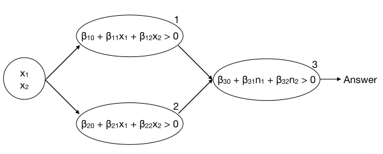

Introduction
============

As discussed in this week's module, we are going to take a peek at deep
learning. Specifically, we will train a model to read handwritten
numbers following the [Keras tutorial](https://keras.rstudio.com/) put
together by Rstudio.

Before you start, you may need to install the `keras` pacakge. If you
are unable to install it locally, you can use the BIFX server.

Quiz solution
-------------

For this week's quiz we created a very simple network that would perform
the exclusive-or (XOR) operation. Here is our network:

If we set the coeffieicnts as follows, our network will return TRUE when
either x1 or x2 are TRUE, but not both.

<table>
<thead>
<tr class="header">
<th align="center">Node</th>
<th align="center">Coefficient</th>
<th align="right">Value</th>
</tr>
</thead>
<tbody>
<tr class="odd">
<td align="center">1</td>
<td align="center">β10</td>
<td align="right">-5</td>
</tr>
<tr class="even">
<td align="center">1</td>
<td align="center">β11</td>
<td align="right">10</td>
</tr>
<tr class="odd">
<td align="center">1</td>
<td align="center">β12</td>
<td align="right">-20</td>
</tr>
<tr class="even">
<td align="center">2</td>
<td align="center">β20</td>
<td align="right">-5</td>
</tr>
<tr class="odd">
<td align="center">2</td>
<td align="center">β21</td>
<td align="right">-20</td>
</tr>
<tr class="even">
<td align="center">2</td>
<td align="center">β22</td>
<td align="right">10</td>
</tr>
<tr class="odd">
<td align="center">3</td>
<td align="center">β30</td>
<td align="right">-10</td>
</tr>
<tr class="even">
<td align="center">3</td>
<td align="center">β31</td>
<td align="right">20</td>
</tr>
<tr class="odd">
<td align="center">3</td>
<td align="center">β32</td>
<td align="right">20</td>
</tr>
</tbody>
</table>

So, if x1 is TRUE and x2 is FALSE, we get the following:

    # netowrk input
    x1 = TRUE
    x2 = FALSE

    # node 1
    β10 + β11*x1 + β12*x2 = -5 + 10*1 + -20*0
                          = 5
    5 > 0
    -> n1 = TRUE

    # node 2
    β20 + β21*x1 + β22*x2 = -5 + -20*1 + 10*0
                          = -25
    -25 < 0
    -> n2 = FALSE

    # node 3
    β30 + β31*x1 + β32*x2 = -10 + 20*1 + 20*0
                          = 10
    10 > 0
    -> TRUE # network output

We can follow the same steps for x1 is TRUE and x2 is TRUE:

    # netowrk input
    x1 = TRUE
    x2 = TRUE

    # node 1
    β10 + β11*x1 + β12*x2 = -5 + 10*1 + -20*1
                          = -15
    -15 < 0
    -> n1 = FALSE

    # node 2
    β20 + β21*x1 + β22*x2 = -5 + -20*1 + 10*1
                          = -15
    -25 < 0
    -> n2 = FALSE

    # node 3
    β30 + β31*x1 + β32*x2 = -10 + 20*0 + 20*0
                          = -10
    -10 < 0
    -> FALSE # network output

Installation
============

Local installation
------------------

Running these commands should get you going, but Windows installation
might be a little more difficult.

    library(devtools)
    install_github("rstudio/keras")

    library(keras)
    install_keras()

The `install_keras` function will install the system utilities that are
called by the `kears` package. There will probably be some additional
tools you'll need to install - `install_keras()` is very helpful in
identifying what is missing. For example, when installing it on the
server, `install_keras()` gave me the following message:

    Error: Prerequisites for installing TensorFlow not available.

    Execute the following at a terminal to install the prerequisites:

    $ sudo apt-get install python-virtualenv

After installing `python-virtualenv`, `install_keras()` performed the
remaining installations and setup.

Using the server
----------------

If you would prefer to use the server, start by logging into the server
in the terminal, or you can use [the Secure Shell App extension for
Chrome](https://chrome.google.com/webstore/detail/secure-shell-app/pnhechapfaindjhompbnflcldabbghjo?hl=en).

You can start R with the `R` command once logged in. The easiest thing
to do is probably to start up an R session on the server and paste code
into the terminal.

To download files you have created you can use `scp` **from your local
machine** (the Secure Shell App allows file transfer as well). For
example, if you were to download the file, *file.txt* in your home
directory, from *server.com*, assuming your username is *user1*:

    scp user1@server.com:~/file.txt .

Tutorial
========

Follow through with the [Keras tutorial](https://keras.rstudio.com/),
and answer the following questions at the end. Be sure to save your
answers, as they will be in the quiz for this week.

Bonus Challenge Problem
=======================

Write a number with a black sharpie on a piece of white paper, take a
picture and see if the model created in the tutorial is able to read
your handwriting. You should keep the following in mind as you work on
this:

-   The model expects a 28x28 image
    -   You will need to make some modifications to your image before it
        is ready for our model
    -   You may want to use [Imagemagick](http://www.imagemagick.org/)
        to crop and resize your image (this is available on the server)
-   I will provide an image for you to test if you have trouble
    processing your image

Hints will follow this evening during class!
